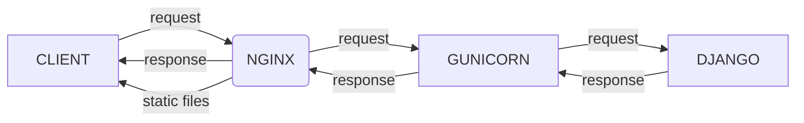

# [Docker](/docs/docker_doc.md) / Production Environment

For the production environment, an NGINX server will be used as a reverse proxy to serve static files and redirect requests to the Django application running on a Gunicorn server.



## NGINX

The NGINX configuration file is located at `docker/prod/nginx/default.conf`. It is listening on port `80` to redirect requests to Gunicorn, which is running on `backend:8000`.

## Entrypoint

The `docker/prod/entrypoint.sh` file is responsible for running the database migrations, loading the static files, and starting the Gunicorn server.

## Admin Authentication

Once you have started the production environment with:

```bash
make build && make up
```

In another terminal, you will need to create the superuser to access the Django admin panel:

```bash
make createsuperuser
```
